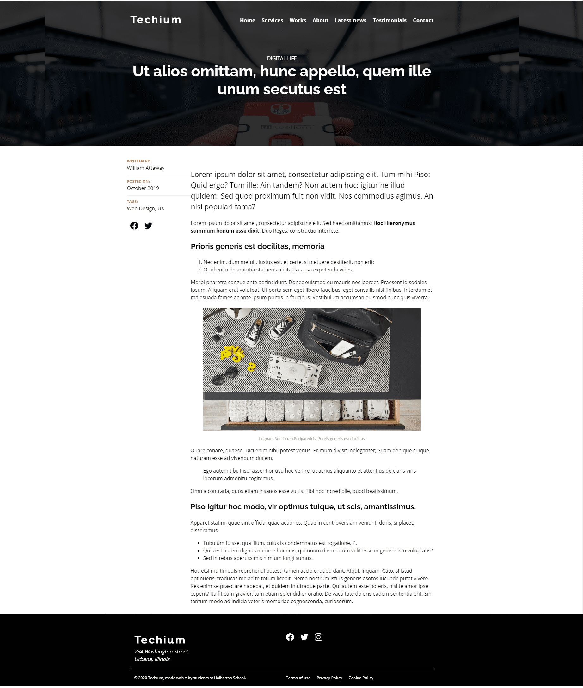
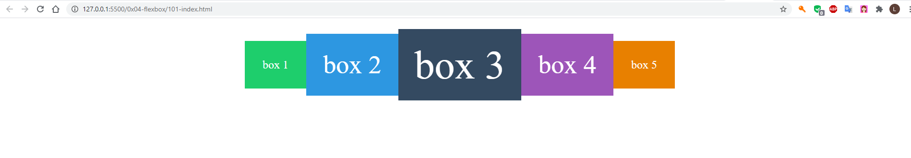

## Description

CSS flexbox layout implementation, use of different properties for the parent element (the flex container) and the child elements (the flex items).

---
## Tasks
#### [0. Add display flex "CSS file"](./0-styles.css) - [HTML file](./0-index.html)
#### [1. Add new classes on sections "CSS file"](./1-styles.css) - [HTML file](./1-index.html)
#### [2. Reverse order Latest news cards "CSS file"](./2-styles.css) - [HTML file](./2-index.html)
#### [3. Simplify services list "CSS file"](./3-styles.css) - [HTML file](./3-index.html)
#### [4. Playing around with the spacing between flex service items "CSS file"](./4-styles.css) - [HTML file](./4-index.html)
#### [5. Flexify the header "CSS file"](./5-styles.css) - [HTML file](./5-index.html)
#### [6. Flexify the navbar "CSS file"](./6-styles.css) - [HTML file](./6-index.html)
#### [7. Align center logo and navbar "CSS file"](./7-styles.css) - [HTML file](./7-index.html)
#### [8. Simplify the hero banner "CSS file"](./8-styles.css) - [HTML file](./8-index.html)
#### [9. Better alignment about us "CSS file"](./9-styles.css) - [HTML file](./9-index.html)
#### [10. Creating an article by fixing issues and updating hero styles "CSS file"](./10-styles.css) - [HTML file](./10-article.html)
#### [11. Update the new hero banner "CSS file"](./11-styles.css) - [HTML file](./11-article.html)
#### [12. The structure of the main article "CSS file"](./12-styles.css) - [HTML file](./12-article.html)
#### [13. The meta list inside the aside section "CSS file"](./13-styles.css) - [HTML file](./13-article.html)
#### [14. Add the share social icons "CSS file"](./14-styles.css) - [HTML file](./14-article.html)

## Advanced tasks
#### [15. Finalizing the cherry on the cake that is the article "CSS file"](./100-styles.css) - [HTML file](./100-article.html)

#### [16. Timemachine boxes! "CSS file"](./101-style.css) - [HTML file](./101-index.html)

---

## Author
#### Luz Sánchez Bolaños
- Github: [zulsb](https://github.com/zulsb)
- Twitter: [@LuzSanchezB](https://twitter.com/LuzSanchezB)

Cohort 10 |
Cali, Colombia 2020