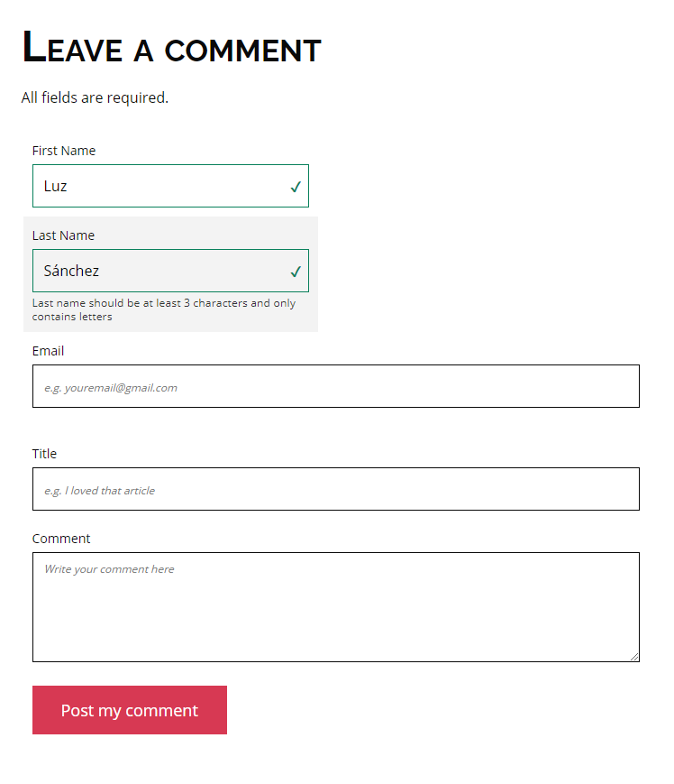

## Description

The HTML form is a tool whose purpose is to interact with the user, in this project I handled fundamental elements for a basic form for comments in HTML and in CSS, the corresponding styles and validations were provided.

---
## Tasks
#### [0. basic comment structure "CSS file"](./01-styles.css) - [HTML file](./01-article.html)
#### [1. more comment basic structure "CSS file"](./02-styles.css) - [HTML file](./02-article.html)
#### [2. create labels and input container "CSS file"](./03-styles.css) - [HTML file](./03-article.html)
#### [3. create the inputs "CSS file"](./04-styles.css) - [HTML file](./04-article.html)
#### [4. add help messages "CSS file"](./05-styles.css) - [HTML file](./05-article.html)
#### [5. add pure HTML / CSS error handling "CSS file"](./06-styles.css) - [HTML file](./06-article.html)
#### [6. add the search form "CSS file"](./07-styles.css) - [HTML file](./07-article.html)

---

## Author
#### Luz Sánchez Bolaños
- Github: [zulsb](https://github.com/zulsb)
- Twitter: [@LuzSanchezB](https://twitter.com/LuzSanchezB)

Cohort 10
Colombia - Cali - 2020