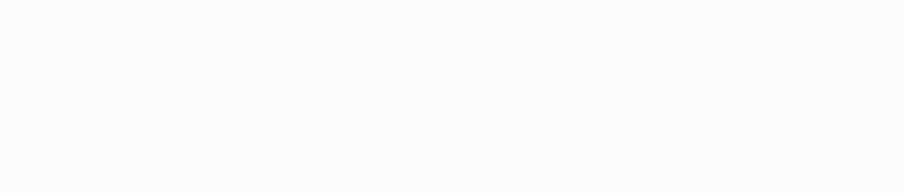

## Description

Accessibility means that websites, tools, and technologies are designed and developed so that people with disabilities can use them. The people can: perceive, understand, navigate, and interact with the Web, and contribute to the Web.

---
## **Content**

#### 0. make the "works" card focus visible --> [CSS file](./keyboard/01-styles.css) - [HTML file](./keyboard/01-index.html)

#### 1. add the skip-links --> [CSS file](./skip-links/01-styles.css) - [HTML index file](./skip-links/01-index.html) - [HTML article file](./skip-links/01-article.html)

#### 2. Elements must have sufficient color contrast --> [HTML file](./fix-a11y/01-index.html)

#### 3. Documents must have title element to aid in navigation --> [HTML file](./fix-a11y/02-index.html)

#### 4. <html> element must have a lang attribute --> [HTML file](./fix-a11y/03-index.html)

#### 5. Images must have alternate text --> [HTML file](./fix-a11y/04-index.html)

#### 6. Form elements must have labels --> [HTML file](./fix-a11y/05-index.html)

#### 7. Links must have discernible text --> [HTML file](./fix-a11y/06-index.html)

#### 8. Zooming and scaling must not be disabled --> [HTML file](./fix-a11y/07-index.html)

#### 9. Heading levels should only increase by one and all page content must be contained by landmarks --> [HTML file](./fix-a11y/08-index.html)

#### 10. Document must have one main landmark --> [HTML file](./fix-a11y/09-index.html)

#### 11. More than 2 elements become list --> [HTML file](./fix-a11y/10-index.html)

---

## Author
#### Luz Sánchez Bolaños
- Github: [zulsb](https://github.com/zulsb)
- Twitter: [@LuzSanchezB](https://twitter.com/LuzSanchezB)

Cohort 10 |
Cali, Colombia 2020